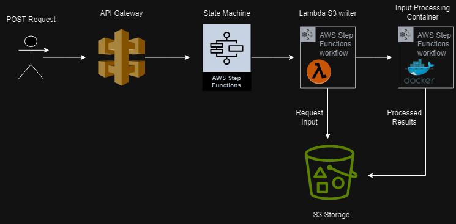

# Euclid

This service is capable of complex mathmatical calculations just like the ancient Greek mathmatician of the same name!


## 🤺Challenge
You're tasked with designing a processing pipeline using Pulumi and AWS step functions. Your input is the following JSON blob as a string:

```json
{ "a": <number>,"b": <number> }
```

Please build a step function definition that achieves the following:

Writes the json to a shared storage
Runs a ECS task that performs the following operation: a + b = c
Writes "C" to the same shared storage as a workflow output.
You can use any language you want within the ECS/docker container, at RISC Zero we mostly use rust but it's not a requirement for this.

## Architecture


## Installation
For installation please see [INSTALL.md](./INSTALL.md)

## Service Input

The service is available at the `outputServiceEndpoint`(Pulumi Output) and accepts a POST request with JSON body with the following structure:
```json
{ "a": <int>, "b": <int> }
```

An example full request using curl would look like this:
```bash
curl -X POST -H "Content-Type: application/json" -d '{ "a": 20, "b": 50 }' https://1oxwxuvm4h.execute-api.us-east-1.amazonaws.com/prod/euclid
```

## Service Output
Assuming valid input, the service will save the JSON body of the request to file with the current datetime. This file will be uploaded to the S3 bucket specified as `outputBucketName` in your Pulumi output and will have the prefix `input`. Once processing has taken place, a file with the same name will be uploaded to S3 with the prefix `output` that contains the sum of the integers provided in the input.